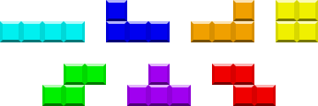

# Instalando e configurando a biblioteca SDL #

Para criar nosso jogo de tetris nós usaremos a biblioteca SDL.

# Os passos para criar o jogo #

Criaremos nosso jogo como uma sequência de "passos", ou "versões" onde cada
versão é construída a partir da anterior. Dessa forma podemos ver como o
cógigo evolui.

## Passo 1: Compilando e linkando com a SDL ##

O primeiro passo é conseguir apenas compilar nosso programa e linkar com a
biblioteca SDL. Para isso vamos criar uma função `main.cpp` que inclui,
inicializa e finaliza a SDL. Se nosso programa compilar isso mostra que ele
conseguiu enxergar a biblioteca SDL e se ele não tiver problemas de
referências indefinidas isso mostra que ele conseguiu linkar corretamente.

Abaixo temos a nossa função main.

{{ d['src_passo1/main.cpp|pyg'] }}

Para compilar nosso programa usaremos o [CMake](http://www.cmake.org/), que
requer a criação de um arquivo chamado de `CMakeLists.txt`. Nosso arquivo
`CMakeLists.txt` contém o conteúdo abaixo.

{{ d['src_passo1/CMakeLists.txt|pyg'] }}

Para compilar nosso programa, devemos então ir na pasta `src_passo1/`,
rodar o comando `cmake .` seguido de `make`, como abaixo.

{{ d['src_passo1/run_cmake_and_compile.sh|shint|pyg'] }}

Com o nosso programa compilado podemos rodá-lo para ver a saída "Hello
SDL".

{{ d["run_passo1.sh|shint|pyg"] }}

## Passo 2: Criando uma janela ##

Agora vamos incrementar nossa função `main.cpp`. Primeiro definimos algumas constantes usando fora da função main como abaixo.

{{ d['src_passo2/main.cpp|idio']["DefineConstantes"] }}

Agora, dentro da nossa função main, criamos os 3 ponteiros abaixo

{{ d['src_passo2/main.cpp|idio']["DeclaraVariaveis"] }}

O primeiro corresponde a janela que iremos criar para exibir nosso jogo. Os
outros dois são "superfícies" (*surface*) para a janela do jogo e para o
fundo. Qualquer coisa que seja copiada para a *surface* correspondendo a
janela do jogo irá aparecer na tela. Note que por enquanto os ponteiros
estão setados como NULL.

Após a declaração dos 3 ponteiros temos a inicialização da SDL como antes.

{{ d['src_passo2/main.cpp|idio']["InicializaSDL"] }}

Agora podemos criar a janela do jogo além da surface ligada a janela. Para
isso usaremos a função `SDL_CreateWindow` como abaixo, seguida de
`SDL_GetWindowSurface`.

{{ d['src_passo2/main.cpp|idio']["CriaJanelaDoJogo"] }}

Note que usamos as constantes `SCREEN_WIDTH` e `SCREEN_HEIGHT` que
definimos anteriormente e testamos se a janela foi de fato criada (se o
ponteiro `gameWindow` foi setado para um valor diferente de NULL. Fazemos
algo semelhante para criar a surface com o fundo da tela, no qual
carregamos a imagem `assets/background.bmp`.

Agora já podemos mostrar a imagem de fundo na nossa janela. Primeiramente
copiamos o conteúdo da surface contendo a imagem de fundo para a surface
correspondendo a janela usando a função `SDL_BlitSurface`[^1]. Após isso,
chamamos a função `SDL_UpdateWindowSurface`[^2] para que o conteúdo da janela
seja atualizado e possamos finalmente ver a imagem na nossa janela. Note
que chamamos a função `SDL_Delay` apenas para que o programa não termine
logo e nós possamos ver nossa janela.

[^1]: O que a função SDL_BlitSurface faz é pegar uma surface de origem (primeiro argumento) e copiar na surface de destino (terceiro argumento). Vamos nos preocupar com o segundo e quarto argumentos depois.

[^2]: Quando você copiar algo para a surface da janela você não está realmente copiando para a imagem que você vê na tela, mas sim para o *back* buffer. Normalmente há o *front* e o *back* buffer e a imagem na tela corresponde ao *front* buffer. Quando você chama `SDL_UpdateWindowSurface` o conteúdo do *back* buffer é finalmente copiado para o *front* buffer de forma que você finalmente pode ver a imagem.

{{ d['src_passo2/main.cpp|idio']["AplicaTelaDeFundo"] }}

Por fim nós limpamos as variáveis criadas dinamicamente. Em geral,
variáveis criadas com `SDL_Create*` possuem uma função equivalente
`SDL_Destroy*` e variáveis criadas com `SDL_Get*` possuem uma função
equivalente `SDL_Free*`. Quais quer outras variáveis criadas dinamicamente
com `new` ou com `malloc` devem ser liberadas normalmente com `delete` e
`free`.

Para finalizar, finalizamos a SDL como antes.

{{ d['src_passo2/main.cpp|idio']["FinalizaSDL"] }}

## Passo 2.5: Reorganizando o código ##

Por enquanto colocamos todo o código na nossa função main no arquivo
`main.cpp`, mas em geral o ideal é que o programa seja escrito de maneira
modular. Vamos reescrever nosso programa até utilizando diferentes funções:
uma para inicializar a SDL, outra para carregar imagens, etc..

Vamos também criar outros arquivos, por exemplo um para conter nossas
constantes, chamado de `general_defs.hpp` que podemos apenas incluir.

{{ d['src_passo2.5/general_defs.hpp|pyg'] }}

Como vamos usar os ponteiros para a janela e para as duas surfaces nessas
funções e na main, **por enquanto** vamos transformá-las em variáveis
globais movendo suas definições para fora da função main.

<!-- Nosso novo -->
<!-- arquivo `main.cpp` é mostrado abaixo. -->

<!--  d['src_passo2.5/main.cpp|pyg']  -->

# Passo 3: Lidando com eventos #

Como estamos criando um jogo isso significa que precisamos tratar
**entradas** feitas pelo jogador. Na SDL isso corresponde a tratar
eventos[^3].

[^3]: Um evento pode ser precionar uma tecla, clicar com o mouse, apertar um botão em um gamepad, etc..

Após a SDL ser iniciada e a media ser carregada, criamos duas variáveis, um
flag `quit` que indica se o usuário saiu ou não (clicou no botão fechar da
janela, por exemplo), e uma variável para do tipo `SDL_Event`.

{{ d['src_passo3/main.cpp|idio']["DeclaraVariaveisParaTratarEvento"] }}

Para a SDL, um evento é algo como pressionar de uma tecla, um movimento do
mouse, o pressionar de um botão de um gamepad, etc. Por enquanto vamos
apenas nos preocupar com o evento de "quit" e finalizar o programa caso ele
ocorra. Para detectar se eventos ocorreram chamamos a função
`SDL_PollEvent`, que retorna 1 caso um evento tenha ocorrido ou 0 se não há
eventos na fila.

Chamamos `SDL_PollEvent` como condição de parada em um outro laço
while. Caso haja um evento então o corpo do while é executado, onde
testamos que tipo de evento ocorreu e se for o evento do tipo `SDL_QUIT`
mudamos nossa flag `quit` para true, como mostrado abaixo.

{{ d['src_passo3/main.cpp|idio']["WhileApplicationIsRunning"] }}

Note que devido ao laço `while( !quit )` o programa só irá terminar quando
o evento `SDL_QUIT` ocorrer. Logo, não precisamos mais chamar `SDL_Delay`
como antes.

# Passo 4: Agindo de acordo com o pressionar de teclas

Outro tipo de entrada que causa um evento é o teclado como tratar uma tecla
pressionada é o que faita para podermos começar a realmente implementar o
noso jogo.

O nosso loop com `SDL_PollEvent` de antes vai recuperar eventos
correspondendo ao pressionar de uma tecla. O tipo desse evento é
`SDL_KEYDOWN`. Vamos adicionar um novo `if` após o teste de `SDL_QUIT` e
testar se o tipo do evento é `SDL_KEYDOWN`. Em caso positivo, podemos
descobrir que tecla foi pressionada comparando `e.key.keysym.sym` com cada
tecla que estamos interessado e tratando de acordo. Nosso laço para o
programa se torna então

{{ d['src_passo4/main.cpp|idio']["WhileApplicationIsRunning"] }}

# Passo 5: Criando o esqueleto do nosso jogo

Caso queira aprender mais sobre a SDL uma excelent referência é o tutorial
[Beginning Game Programming v2.0](http://lazyfoo.net/tutorials/SDL/index.php). Com
o que foi visto até então já podemos começar a escrever nosso jogo de
tetris.

Nosso "tabuleiro" de tetris terá um tamanho total de 11 colunas e 15
linhas, como definido nas variáveis `VALID_SCREEN_WIDTH` e
`VALID_SCREEN_HEIGHT` em `general_defs.hpp`. Cada peça pode ter no máximo até
3 unidades de largura ou de comprimento, como por exemplo a peça abaixo

Para o nosso jogo vamos começar criando três classes: `Game`, `Board` e
`Piece`. A classe `Piece` representa uma peça do tetris que ainda está se
movendo (ou a próxima peça). A classe `Board` representa o tabuleiro de
tetris e é nela que vai ficar quais blocos já estão no tabuleiro, etc. Já a
classe `Game` representa o jogo em si. Tanto as variáveis que antes eram
globais (as surfaces, a janela do jogo, etc) quanto a chamada de diversas
funções da SDL vão ficar na classe `Game`.

